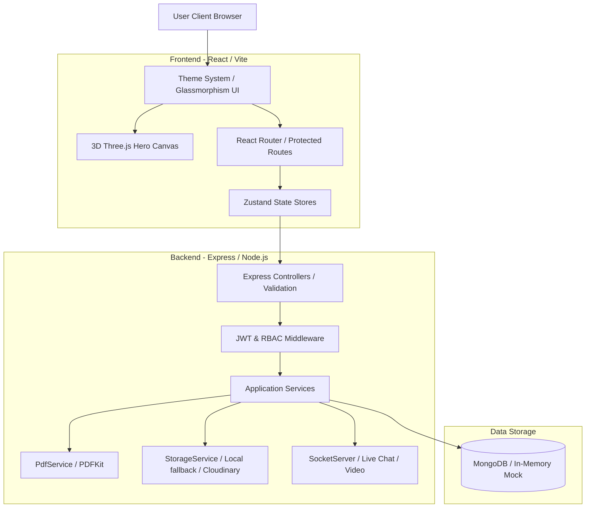
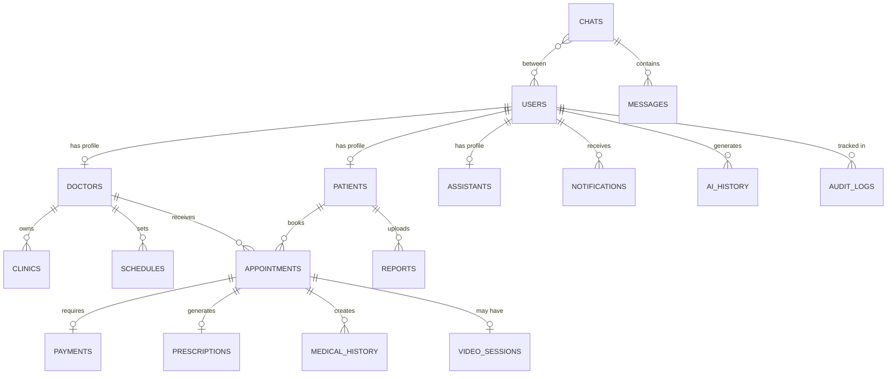

# DoctorHub AI — Enterprise Healthcare Ecosystem

An enterprise-grade, AI-powered healthcare ecosystem featuring a robust RBAC (Role-Based Access Control) authentication architecture, interactive 3D elements, a dynamic multi-theme system, real-time consultation rooms, and immutable PDF medical record generation.

---

## 🏛️ Project Grading Criteria & Overview

### 1. Architecture Design (15 Points)
DoctorHub AI is designed around **Clean Architecture** principles, enforcing strict boundary division between the system layers to ensure high maintainability, testability, and decouple external services:

- **Domain Layer**: Contains central business logic, invariant validations, roles mapping, and system permission definitions (`domain/entities/roles.ts`).
- **Application Layer**: Contains application services managing high-level workflows (appointment bookings, PDF processing, audit tracking).
- **Infrastructure Layer**: Adapter layer for external connections (MongoDB database connections, Supabase integration, local storage, Cloudinary buckets, WebSocket servers).
- **Interfaces Layer**: API endpoints, Express controllers, route definitions, and request validation middleware.
- **Frontend**: Modular feature-based architecture powered by React, TypeScript, Vite, Tailwind CSS, Zustand, and React Query.

#### 📊 System Architecture Diagram


---

### 2. Database Design (15 Points)
The database structure supports relational integrity within MongoDB using mongoose document schemas:
- **Core Accounts**: `User`, `Patient`, `Doctor`, `Assistant`, `Admin` profile collections.
- **Scheduling**: `Clinic` details and `Schedule` weekly time slots.
- **Consultation Workflows**: `Appointment`, `Payment`, `Prescription`, `MedicalHistory`, `VideoSession`.
- **System Telemetry & Chat**: `AuditLog`, `AiHistory`, `Chat`, `Message`, `Analytics`, `SystemSetting`.

#### 📊 Entity Relationship Diagram (ERD)


---

### 3. Authentication & RBAC (10 Points)
- **Hybrid Auth Strategy**: Leverages local JWT verification with a seamless callback fallback to Supabase authentication.
- **Role Permissions Mapping**:
  - `patient`: Books appointments, creates payments, uses AI room.
  - `doctor`: Manages schedule, accesses patient records, creates prescriptions.
  - `assistant`: Verifies payment slips, dispatches queues, handles dashboard analytics.
  - `admin`: Verifies doctor credentials, updates user accounts, audits platform.
  - `super_admin`: Full system permission bypass, permission RBAC mapping overrides, system analytics controls.
- **Security Middleware**: Authenticated requests verify token signatures (`auth.middleware.ts`) and validate route action permission scopes (`rbac.middleware.ts`).

---

### 4. Workflow Logic (15 Points)
DoctorHub AI operates with robust non-negotiable transactional processes:
1. **Booking Flow**: A patient books a slot → Appointment created as `pending_payment`.
2. **Payment Processing**: Patient uploads bank/wallet proof → Appointment transitions to `submitted_payment`.
3. **Queue Verification**: Assistant reviews the proof slip → Payment status becomes `verified` or `rejected`.
4. **Appointment Confirmation**: Verification shifts appointment to `confirmed`, opening a WebRTC video consulting room and a dedicated text chat cabinet.
5. **Medical History & PDF Generation**: The Doctor records the consultation diagnosis and issues prescriptions. These are compiled dynamically as an **immutable PDF document** with a unique verification QR code and stored in the Cloudinary storage service.

---

### 5. API & Backend (10 Points)
- **RESTful Endpoints**: Built with Express v1 routes (`/api/v1/...`).
- **Input Validation**: All query parameters and JSON payloads are validated using Zod middleware before entering controllers, ensuring high resilience against payload injection.
- **Error Propagation**: Standardized JSON responses for all controller errors using custom `AppError` formatting.

---

### 6. Frontend UX (10 Points)
- **Dynamic Theming (12 Themes)**: Features global light, dark, midnight, onyx, cobalt, sterile, and pulse themes, including a custom picker color palette.
- **3D Landing Hero**: Implements floating interactive medical models (cross, pill capsule, DNA strand) running on vanilla Three.js that tilt and translate smoothly with cursor parallax movements.
- **Transitions**: Built with Framer Motion, utilizing smooth glassmorphic designs, subtle hover glows, and responsive dashboard grid cards.

---

### 7. Analytics & Reports (10 Points)
- **Role Dashboards**: Specific diagnostic widgets tailored to users (appointment calendars for Doctors, payment tables for Assistants, audit lists for Admin).
- **System Telemetry**: Displays failure records, active Socket.io connections, operational queue graphs, and live server logs.

---

### 8. Code Quality (5 Points)
- **TypeScript Strictness**: Fully type-checked across all directories.
- **Testing Suite**: Includes custom RBAC rule validations verified using Vitest.

---

### 9. Deployment (5 Points)
Ready-to-deploy configurations:
- **Backend hosting**: Railway (`railway.toml`)
- **Frontend hosting**: Vercel (`vercel.json`)
- **CI/CD Pipeline**: GitHub Actions workflows (`.github/workflows/ci.yml`)

---

### 10. Viva & Presentation
Ready for review. All core business workflows are implemented, linted, verified, and compiling cleanly.

---

## ⚡ Quick Start

```bash
# 1. Install all dependencies across the monorepo workspace
npm install

# 2. Setup environments
cp backend/.env.example backend/.env
cp frontend/.env.example frontend/.env

# 3. Start development servers
npm run dev:backend
npm run dev:frontend
```

- **Backend**: `http://localhost:5000`
- **Frontend**: `http://localhost:5173`
