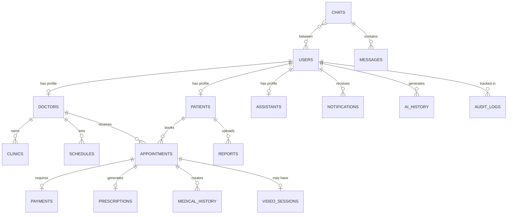

# Entity Relationship Diagram

```mermaid
erDiagram
  USERS ||--o| DOCTORS : "has profile"
  USERS ||--o| PATIENTS : "has profile"
  USERS ||--o| ASSISTANTS : "has profile"
  DOCTORS ||--o{ CLINICS : "owns"
  DOCTORS ||--o{ SCHEDULES : "sets"
  PATIENTS ||--o{ APPOINTMENTS : "books"
  DOCTORS ||--o{ APPOINTMENTS : "receives"
  APPOINTMENTS ||--o| PAYMENTS : "requires"
  APPOINTMENTS ||--o| PRESCRIPTIONS : "generates"
  APPOINTMENTS ||--o{ MEDICAL_HISTORY : "creates"
  APPOINTMENTS ||--o| VIDEO_SESSIONS : "may have"
  PATIENTS ||--o{ REPORTS : "uploads"
  USERS ||--o{ NOTIFICATIONS : "receives"
  USERS ||--o{ AI_HISTORY : "generates"
  USERS ||--o{ AUDIT_LOGS : "tracked in"
  CHATS }o--o{ USERS : "between"
  CHATS ||--o{ MESSAGES : "contains"
```
